# UI Editor

The UI editor turns the dashboard itself into the configuration screen. You add pages, drag widgets into columns, change their options and pick your colors from the page you are looking at, and Dynacat writes the result straight back into your config files.

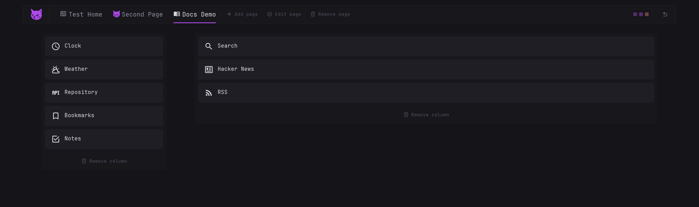

It is an addition to the config file, not a replacement for it. Everything the editor writes is normal YAML, and hand written config keeps working exactly as before.

## Opening the editor

Click the pencil icon in the header, on the right of the theme picker.

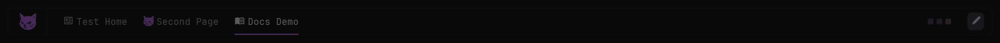

The pencil only shows up when you are allowed to edit:

| Setting | Effect |
| ------- | ------ |
| [`ENABLE_EDITOR`](docker-options.md#enable_editor) | `false` hides the button everywhere and unregisters the editor API |
| [`allow-editing`](configuration.md#allow-editing) | `false` disables the editor for everyone |
| [`editing-users`, `editing-groups`](configuration.md#editing-users-editing-groups) | Limit editing to certain users or groups |

If authentication is enabled you also have to be logged in. See [Editing Access Control](authentication.md#editing-access-control) for per user and per page restrictions.

## Adding a widget

The palette sits at the bottom of the screen and holds every widget type.

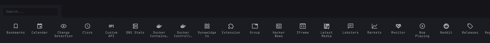

Drag an item from the palette onto a column, or onto an existing widget, and drop it where the marker line appears. 

## Adding a column

Hover the space between two columns, or the space at either edge of the page, and a line with a **+** appears. Click it to insert a column at that spot.

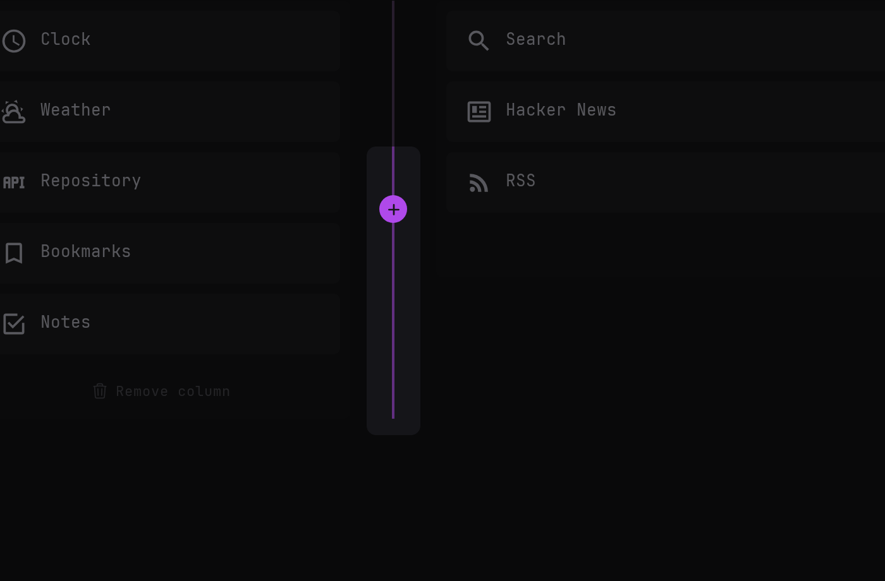

To remove a column, click **Remove column** under it. Its widgets go with it, so you are asked to confirm first.

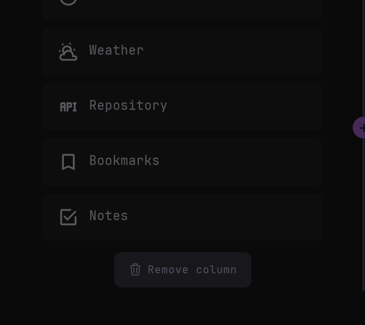

Column sizes themselves are not editable from the canvas, they are set in the config, see [Columns](configuration.md#columns).

## Adding a page

The page tools sit in the header, right after the navigation links.

**Add page** asks for a name and a starting layout. The six layouts are the usual combinations of full and small columns, and the one you pick is only a starting point since columns can be added and removed afterwards.

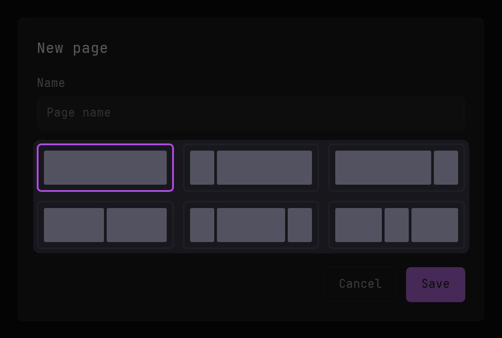

Saving creates the page and takes you straight to it. By default it is written to its own file in the config directory and linked into the main config with an `$include` line, which is controlled by [`EDITOR_SEPARATE_PAGE_FILES`](docker-options.md#editor_separate_page_files).

## Page options

**Edit page** opens the options of the page you are on.

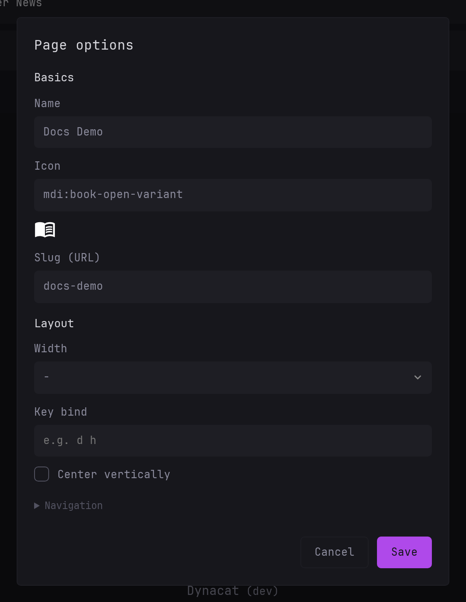

| Section | Options |
| ------- | ------- |
| Basics | **Name**, **Icon** and **Slug (URL)**, which is generated from the name when left empty |
| Layout | **Width**, **Key bind** and **Center vertically** |
| Navigation | **Hide from navigation**, **Hide desktop navigation**, **Show mobile header** and **Desktop navigation width** |

They map one to one onto the page properties in the config file, see [Pages](configuration.md#pages) for what each one does. Because the name and the slug can change, saving navigates to the page's new address.

**Remove page** deletes the page you are on after a confirmation and sends you back to the dashboard's root page.

> [!NOTE]
>
> Pages that come from a file Dynacat cannot write to, such as a read only bind mount, refuse to be edited and say so instead.

## Theming

With the editor on, the theme picker in the header no longer switches the theme, it opens the styling modal.

The row of swatches at the top is the list of themes. The first one is the default theme, the `theme:` key of your main config, and the rest are your [presets](configuration.md#presets). Click one to load its values into the fields below.

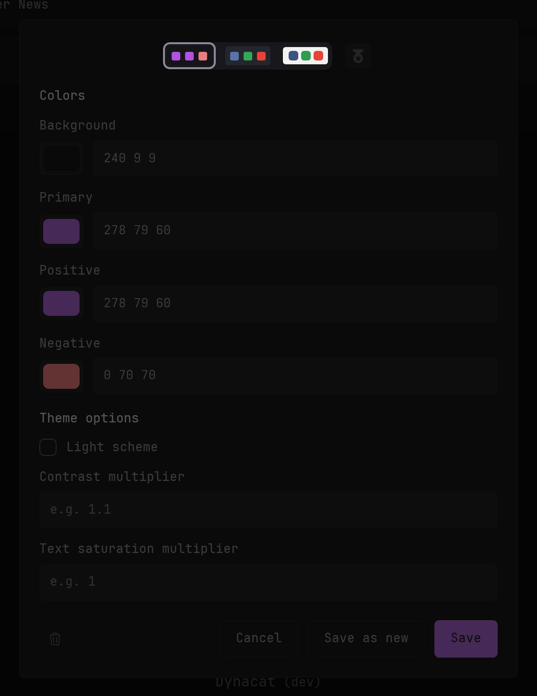

**Background**, **Primary**, **Positive** and **Negative** take an HSL triple, e.g. `240 8 9`, but also hex and rgb. The swatch next to each field previews it. Under **Theme options**, **Light scheme** switches the theme to a light one, and **Contrast multiplier** and **Text saturation multiplier** adjust the generated text colors. All of them are described in [Theme](configuration.md#theme), and [Themes](themes.md) has ready made values you can paste in.

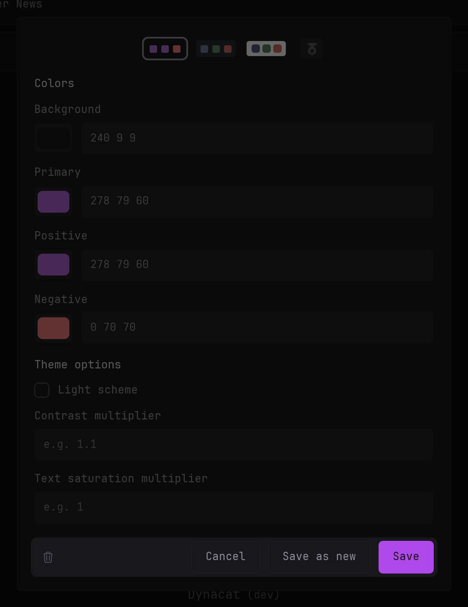

The three buttons on the right act on the theme that is selected:

| Button | Effect |
| ------ | ------ |
| **Save** | Writes the values back into the selected theme |
| **Save as new** | Asks for a name and stores the current values as a new preset |
| Trash icon | Deletes the selected preset, or resets the default theme to the built-in one |

### Branding

The medal icon at the end of the swatch row opens the branding page of the same modal.

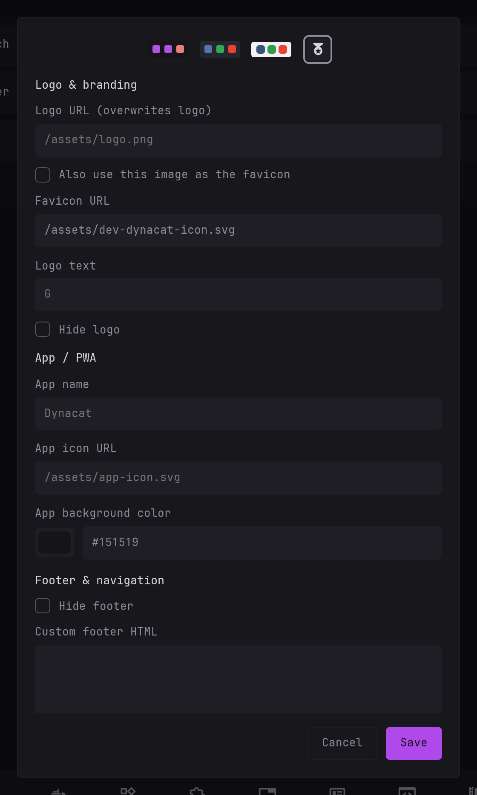

It covers the logo and favicon, the PWA name, icon and background color, and the footer and navigation options, all of them the [branding](configuration.md#branding) properties. **Also use this image as the favicon** copies the logo URL into the favicon field and keeps the two in sync, so you only fill in one.

## Custom API widgets

A `custom-api` widget has two things no other widget has. Its options start with a **Paste YAML** row, where pasting the YAML of a widget fills in every option below it and clears the ones the paste does not mention, and at the bottom left there is an **Open Editor** button.

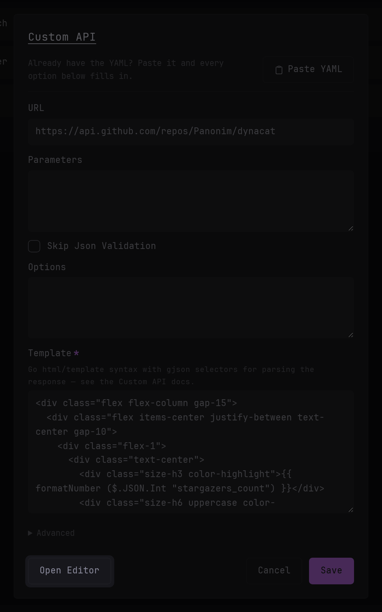

It opens a fullscreen builder where you drag blocks onto a canvas and bind them to fields of the API response instead of writing the `template` by hand. See [Widget Editor](widget-editor.md) for the whole thing.

## How changes are saved

Every action saves immediately, there is no separate save step for the page as a whole. Dynacat rewrites only the file the page came from, keeping your comments and `$include` lines intact, and the canvas redraws itself from the new config.

Adding, editing or removing a page changes the page you are standing on, so those wait for the config to reload and then navigate. The editor is still on when the page comes back.

> [!IMPORTANT]
>
> Blank lines between entries are lost when a file is rewritten, the content itself is not.

If a change is rejected, for example because an option is invalid or the file cannot be written to, the config is left exactly as it was and the reason appears as a message in the top right corner of the screen.
