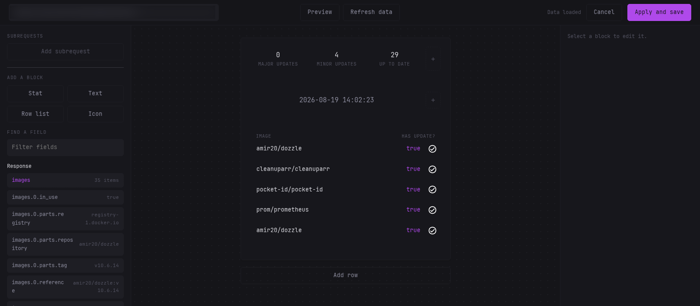
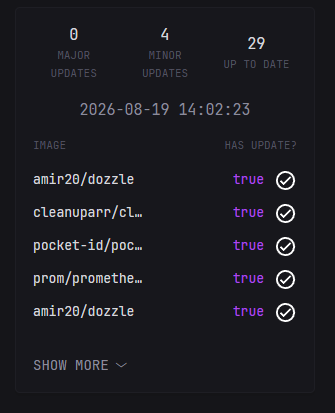
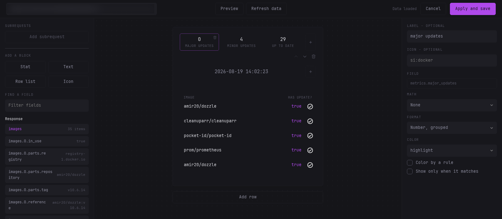
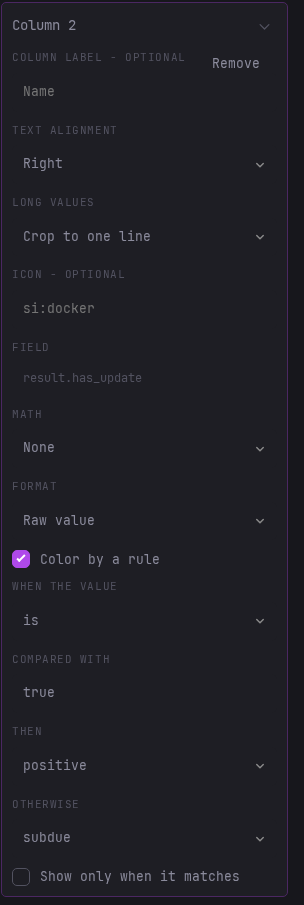
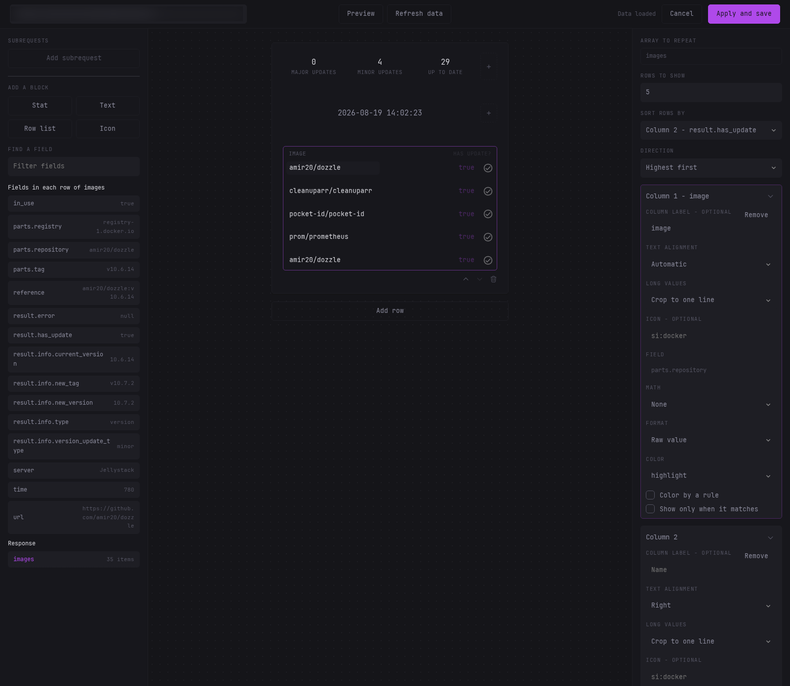
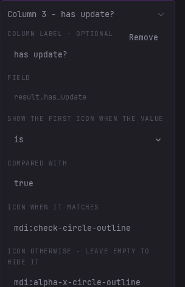
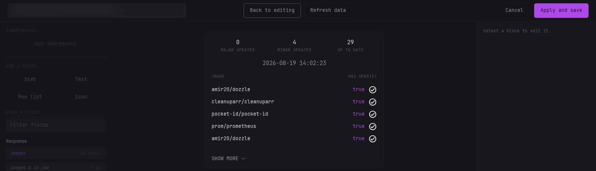

# Widget Editor

The widget editor is a fullscreen visual builder for `custom-api` widgets. You point it at an API, drag blocks onto a canvas, bind them to fields from the response and it writes the `template` for you.



It is an addition to the template textarea, not a replacement for it. Hand written templates keep working exactly as before, and everything on this page ends up as a normal `template` in your config.

## Example widget made only with the editor



## Opening the editor

1. Open the page editor with the pencil icon in the header.
2. Edit an existing `custom-api` widget, or add a new one.
3. In the widget options modal, click **Open Editor** at the bottom left.

> [!NOTE]
>
> The editor needs a viewport of at least 1024px wide.

## Layout

The editor takes over the whole screen and is split into four areas:

| Area | Contents |
| ---- | -------- |
| Top bar | The request url, **Preview**, **Refresh data**, a status line, **Cancel** and **Apply and save** |
| Left pane | The subrequests, the block palette, and the list of fields found in the API response with a sample value for each |
| Middle | A dotted canvas holding a preview of the widget |
| Right | The inspector for the currently selected block |

**Apply and save** writes the template and saves the widget in one step. **Cancel** leaves the saved widget exactly as it is.

## Fetching data

The editor fetches the url once when it opens, and again every time you press **Refresh data**.

`${VARIABLE}` references in the url and in headers are expanded the same way they are in the config file, so widgets that depend on a token or a secret work in the editor too.

The field paths listed in the left pane are [gjson](https://github.com/tidwall/gjson) paths, the same syntax you would use in a hand written template.

## Blocks

Blocks are the building pieces of the widget:

- **Stat** - a value with an optional label under it, and an optional icon. Leave the label blank to render only the value.
- **Text** - static text, with an optional icon.
- **Row list** - repeats a row of columns for every item in a JSON array.
- **Icon** - an icon on its own, using the same icon syntax as the rest of Dynacat (`si:`, `sh:`, `mdi:` or a url). See [Icons](configuration.md#icons).

Blocks live in rows. A row holds up to four blocks side by side and they share the width evenly, except icons which stay at their natural size. A row list always takes a row of its own. Hovering a row reveals controls to move it up or down and to remove it.

To place a block, drag it from the palette onto a row, onto an existing block, or onto the empty canvas.

Anywhere an icon can be set, stats, text blocks and row list columns alike, **Icon position** puts it before or after the value.

## Binding a field

Select a block, then click a field in the left pane. You can also drag a field from the left pane straight onto a block.

### Value options

These options are available per stat, and per column of a row list.



#### Math

Add, subtract, multiply or divide the value by a constant.

#### Format

| Format | Result |
| ------ | ------ |
| Raw value | The value as it came from the API |
| Number | Thousands separators, e.g. `1,000` |
| Short number | e.g. `1k`, `2m` |
| Bytes | `KB`, `MB`, `GB` |
| Fixed decimals | A fixed number of decimal places |
| Percent | The value as a percentage |
| Percent change | The change against another field |
| Date | A formatted date |
| Relative time | e.g. `2h`, `1d`, and keeps counting on the page |

The bytes format uses the `formatBytes` template function, which is also available to hand written `custom-api` templates.

#### Colors

Pick one of the theme colors: highlight, primary, positive, negative, subdue, paragraph or base. Raw hex values are never used, so your widget follows whichever theme is active.

#### Color by a rule

Tick **Color by a rule** to pick the color from the value itself. Numeric values compare with greater than, less than, at least, at most or equal to. Everything else, including `true` and `false`, compares with is or is not. Set the value to compare with, then the color to use when it matches and the one to use when it does not. This is how you get a green value when something is up and a red one when it is down.



#### Show only when it matches

Tick **Show only when it matches** to render the stat or column only when its field passes a comparison. The same comparisons are available as for rules, so a field can disappear when it is empty, or a row can only show a value when a flag is `true`.

## Row lists

A row list repeats a row of columns for every item in an array.

1. Pick the array to repeat over. Only array fields are offered here.
2. Once it is bound, the left pane shows a group named `Fields in each row of <path>`, listing the fields of the first item. Those are the fields the columns bind to.
3. Set **Rows to show** to choose how many rows are visible. The rest stay behind a show more control in the rendered widget rather than being dropped.



Each column can have an optional label and an optional icon. As soon as any column has a label, a header line is rendered above the rows. Columns share the row width evenly so the values line up under their labels, with the first column aligned left and the last one right. **Text alignment** overrides that per column. **Long values** decides what happens when a value does not fit: `Crop to one line` keeps every row one line high and ends the value with an ellipsis, `Wrap over two lines` lets it wrap, breaking words where it has to and stopping after two lines so one long value cannot stretch the widget.

Every column gets its own card in the right pane. Click a card title to collapse or expand it, and click a value in the preview to have its card scrolled into view. A collapsed card opens while its value is the one you picked and folds back once you pick another, so the state you set is never lost.

Use **Sort rows by** to sort, together with a direction. The comparison is picked from that column's format, so numbers sort numerically, dates sort chronologically and everything else sorts as text.

### Icon columns

**+ Icon column** adds a column that shows an icon chosen by the value of a field, which is how you get a check for `true` and a cross for `false`:

1. Give the column a label if you want one above it in the header line. The column keeps the width of its icon either way, so the label hangs over the space to its left rather than widening the column, and nothing else moves. Keep it short, a long label reaches into the label next to it.
2. Click the field the column should read.
3. Pick the comparison and the value to compare with, for example `is` and `true`.
4. Set the icon shown when it matches, and optionally the one shown when it does not. Leaving the second icon blank hides the icon in that case while the column keeps its width, so the rows stay aligned.



A row list is removed by removing its row, it has no delete control of its own.

## Subrequests

**Subrequests** sits at the top of the left pane and holds named extra requests, each with a name and a url. Their fields then appear as their own group in the same pane and can be bound like any other field.

In the generated template they are reached with `.Subrequest "name"`.

## Preview

The **Preview** toggle renders the template on the server using the real API data and shows the actual widget, so you can check the result before saving. It stays live: keep editing in the inspector and the preview re-renders on its own. Toggle it off to go back to the editable canvas.



## Saving and validation

**Apply and save** runs three steps:

1. It checks the blocks, for example a stat with no field bound, or a row list with no array selected.
2. It compiles and renders the template on the server.
3. Only if both pass does it write the `template` into the widget and save the config.

Any template error is shown in the status line and the editor stays open, so nothing is lost.

## The builder key

Saving also writes a `builder:` key on the widget, a compact JSON snapshot of your layout so that reopening the editor restores your blocks. It is ignored when the widget renders.

Deleting it by hand only loses the visual layout, the template keeps working.

> [!IMPORTANT]
>
> If you hand edit a template that the editor produced, reopening the editor regenerates the template from the stored layout and overwrites your edits. Pick one approach per widget.

## Opening the editor on a hand written template

If a widget has a `template` but no `builder` key, the editor starts empty and warns you that applying will replace the template. Cancelling leaves the widget untouched.

## Example

Given this response:

```json
{
  "total_count": 1284,
  "items": [
    { "name": "dynacat" },
    { "name": "dynawidgets" }
  ]
}
```

A widget with one stat bound to `total_count` (labelled "Repos", number format, highlight color) and a row list over `items` showing 5 rows with one column bound to `name` produces:

```html
<div class="flex flex-column gap-15">
  <div class="flex items-center justify-between text-center gap-10">
    <div class="flex-1">
      <div class="text-center">
        <div class="size-h3 color-highlight">{{ formatNumber ($.JSON.Int "total_count") }}</div>
        <div class="size-h6 uppercase color-subdue">Repos</div>
      </div>
    </div>
  </div>
  <ul class="list list-gap-10 collapsible-container" data-collapse-after="5">
    {{ range $item := $.JSON.Array "items" }}
    <li class="flex items-center gap-10">
      <div class="flex-1 min-width-0 text-left color-highlight">{{ $item.String "name" }}</div>
    </li>
    {{ end }}
  </ul>
</div>
```

This is a normal `custom-api` template. If you ever remove the `builder` key, it keeps rendering as it is and you can carry on editing it by hand.
